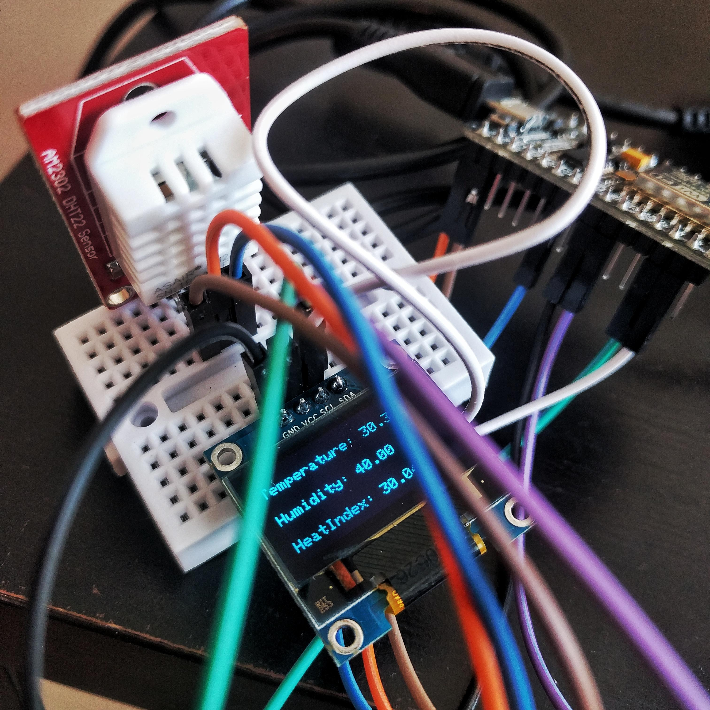
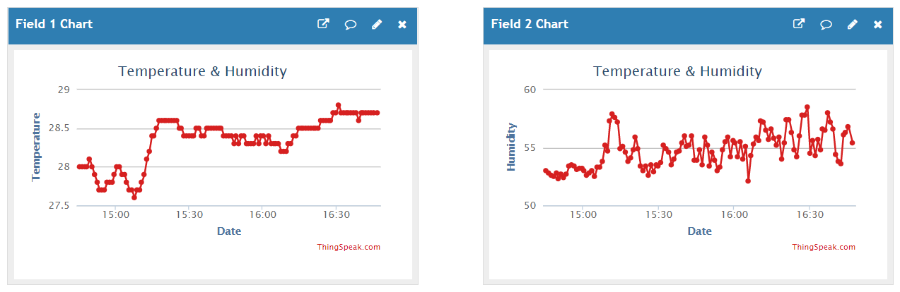

# Temperature & Humidity IoT :unamused:

*Super awesome, super new, super never done before, state of the art, mind wrecking project* :star2: :star: :sparkles:

With a DHT22 sensor we log the values to a private Thingspeak channel and we also display it on a mini oled display.

Currently I use this, to monitor the temperature for my puppy :dog2: when he is home alone,
and get an alert if it would be too high for him.

## Hardware
- Nodemcu V3 board (v.0.9)
- DHT22 digital temperature and humidity sensor
- 128x64 mini Oled display

## Images

